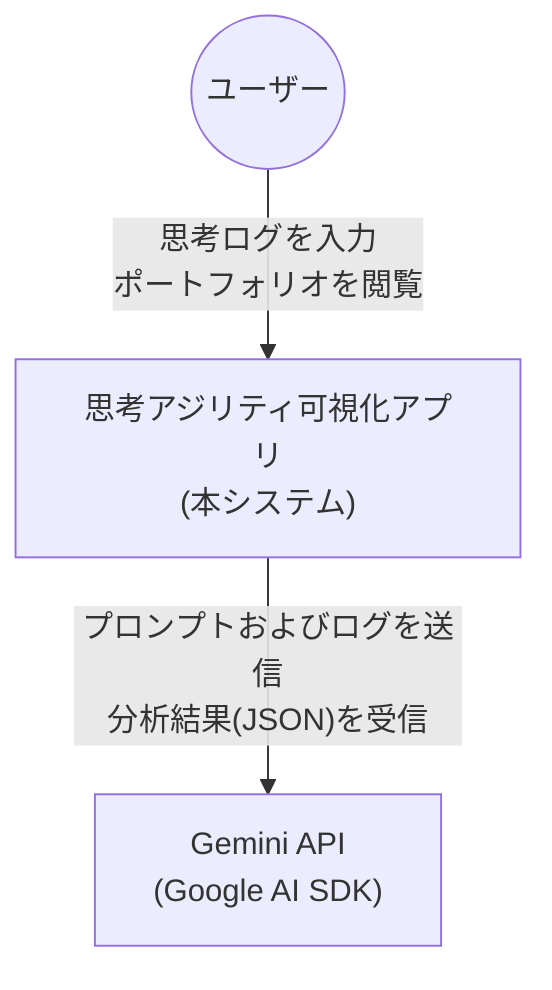
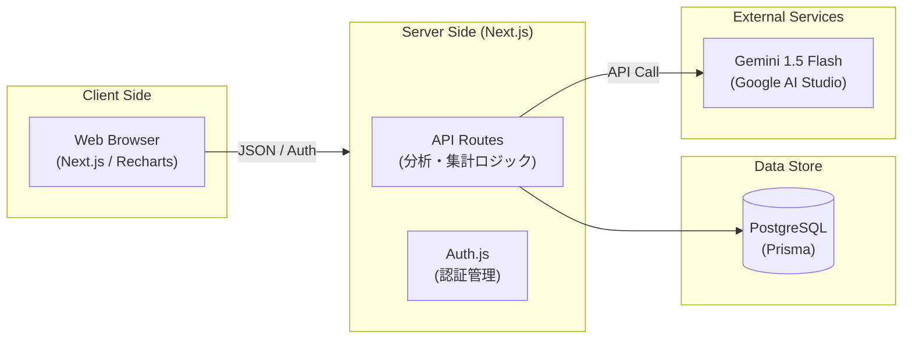
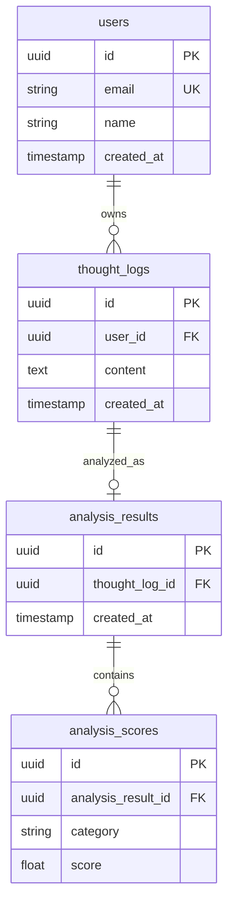

# Recpter（リセプター）

> 思考アジリティ可視化アプリ  
> ユーザーの思考ログをAIが分析し、思考の偏りを構造的に可視化することで、客観的な自己理解と柔軟な思考を育てる支援を行うWebアプリケーション。


-----

## 📌 概要

「食わず嫌い」による思考の固定化を可視化し、RadarChartで自己診断できるHRテック寄りサービス。思考ログを入力するだけで、AIが5カテゴリでスコアリングし、Agility Scoreとして思考の柔軟性を0〜100で数値化する。

-----

## 🛠 技術スタック

|レイヤー    |技術                                                          |
|--------|------------------------------------------------------------|
|フロントエンド |Next.js (App Router) / TypeScript / Tailwind CSS / Shadcn/ui|
|データ可視化  |Recharts（RadarChart）                                        |
|認証      |Auth.js (NextAuth v5)                                       |
|DB / ORM|PostgreSQL / Prisma                                         |
|AI連携    |Google AI SDK / Gemini 1.5 Flash                            |
|開発支援    |Claude Code / CLAUDE.md運用                                   |
|デプロイ    |Render / Railway（予定）                                        |

-----

## 🏗 システム構成

### システムコンテキスト図



### アーキテクチャ図



-----

## 📁 ディレクトリ構成

```
src/
├── app/
│   ├── (auth)/           # 認証関連 (Login/Register)
│   ├── api/
│   │   ├── auth/         # Auth.js設定
│   │   ├── logs/         # POST(新規分析) / PATCH(編集) / DELETE(削除)
│   │   │   └── [id]/
│   │   └── portfolio/    # GET(統計データ取得)
│   ├── thought-log/      # 思考ログ管理画面
│   ├── portfolio/        # ダッシュボード
│   ├── layout.tsx
│   └── page.tsx
├── components/
│   ├── ui/               # Shadcn/ui
│   ├── layout/           # Navbar, Sidebar, Footer
│   └── charts/           # RadarChart, AgilityScoreBadge
├── lib/
│   ├── prisma.ts         # Prisma Client初期化
│   ├── gemini.ts         # Logic A: Gemini API連携
│   ├── agility-logic.ts  # Logic B: Agility Score算出
│   └── utils.ts
├── types/
│   ├── index.d.ts
│   └── api.ts
└── prisma/
    └── schema.prisma
```

-----

## 🧠 独自ロジック

### Logic A：AI思考分析（`lib/gemini.ts`）

Gemini 1.5 Flashを使用し、単一ログから5カテゴリのスコアをJSON形式で取得。新規投稿時のみAPIを呼び出し、編集・削除時はコストゼロで再計算する設計。

**思考カテゴリ**

|カテゴリ       |説明                |
|-----------|------------------|
|Analytical |論理思考・問題分解・根拠に基づく判断|
|Strategic  |長期視点・目標設計・全体最適    |
|Exploratory|未知への好奇心・仮説検証・アイデア |
|Reflective |自己客観化・振り返り・気づきの言語化|
|Social     |他者理解・共感・チーム協働     |

### Logic B：Agility Score算出（`lib/agility-logic.ts`）

過去ログから思考の柔軟性を0〜100で数値化する独自アルゴリズム。

```
Agility Score = (多様性 × 0.4) + (更新度 × 0.3) + (領域数 × 0.3)
```

|要素 |内容               |
|---|-----------------|
|多様性|5カテゴリのスコア分布（標準偏差）|
|更新度|直近ログと過去平均の乖離     |
|領域数|スコア0.5超のカテゴリ数    |

-----

## 🗄 データベース設計



-----

## 🗺 開発ロードマップ

### Sprint 1：基盤構築

- [ ] Next.jsプロジェクト初期化（Shadcn/ui・Tailwind）
- [ ] Prisma Schema定義・DBマイグレーション
- [ ] Auth.js (v5) セットアップ・認証ガード実装
- [ ] 共有レイアウト（Nav/Sidebar）作成

### Sprint 2：AI分析エンジン

- [ ] Gemini API連携クラス実装（`lib/gemini.ts`）※完全手動
- [ ] `POST /api/logs` エンドポイント実装
- [ ] 思考ログ入力フォームUI
- [ ] Loading状態管理・ログ履歴一覧

### Sprint 3：スコア計算・可視化

- [ ] Agility Score算出アルゴリズム実装（`lib/agility-logic.ts`）※完全手動
- [ ] 算出ロジックの単体テスト（境界値対応）
- [ ] Rechartsレーダーチャート実装
- [ ] ポートフォリオ・ダッシュボード統合

-----

## 💡 設計上のこだわり

- **AIコスト最適化**：編集・削除時はGemini APIを呼び出さず、既存スコアから再計算
- **型安全性**：`any`を排除し、APIレスポンス・DBモデルの型を厳格に定義
- **AIペアプロ前提**：CLAUDE.mdによる開発ガイドラインを自作し、主導権を持ちながらAIと協働
- **上流から一気通貫**：要件定義・基本設計・詳細設計・DB物理設計まで個人で業務水準のドキュメントを構築

-----

## 👤 開発者

SESでテスター業務に従事しながら、バックエンドエンジニアへの転向を目指して個人開発中。  
**目標**：2026年8月までにNext.js (App Router) でフルスタック開発を完遂し、設計・実装・品質担保まで一人で担えるエンジニアとして市場接続。
